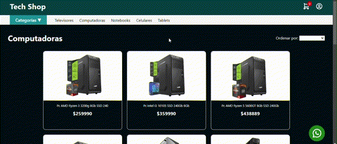

# Proyecto Final para el Curso de JavaScript en CoderHouse  

En este proyecto final, la consigna era desarrollar una aplicación para resolver un problema real del usuario. Decidí crear un **e-commerce** como desafío personal y para demostrar mis habilidades adquiridas durante el curso.  

## Funcionalidades principales  

- **Navegación entre categorías**: Explora los productos organizados en distintas categorías.  
- **Registro de usuario**: Crea una cuenta para interactuar con la aplicación.  
- **Inicio de sesión**: Valida tus credenciales para acceder a funciones avanzadas.  
- **Carrito de compras**: Solo los usuarios autenticados pueden agregar productos al carrito. Si no has iniciado sesión, aparecerá un mensaje de advertencia.  
- **Ordenar productos**: En la sección de categorías, puedes ordenar los precios de los productos de mayor a menor o de menor a mayor.  

### Ejemplo de uso  

**Página de inicio**  
  

**Interacción con un producto**  
  

**Navegación por categorías**  
  

### Usuarios de prueba  

Si deseas probar la validación del inicio de sesión, aquí tienes algunos usuarios predefinidos:  

- **Usuario**: `CoderJS` | **Contraseña**: `Coder123`  
- **Usuario**: `UserOne` | **Contraseña**: `Pass123`  
- **Usuario**: `Admin` | **Contraseña**: `Admin123`  

---

## Stack utilizado  

- **HTML**  
- **CSS**  
- **JavaScript**  

### Librerías  

- **Toastify JS**: Para notificaciones personalizadas y mejor feedback visual.  

---

## Detalles técnicos  

- **Carga de datos**:  
  Los productos y categorías se cargan desde dos archivos JSON.  

- **Gestión de datos**:  
  Para gestionar la sesión del usuario, el registro de nuevos usuarios y el carrito de compras, se utiliza **localStorage**.  

---

## Consideraciones  

Este proyecto representa el aprendizaje acumulado durante el curso, y busqué abordar un desafío realista para poner en práctica las habilidades adquiridas.  
